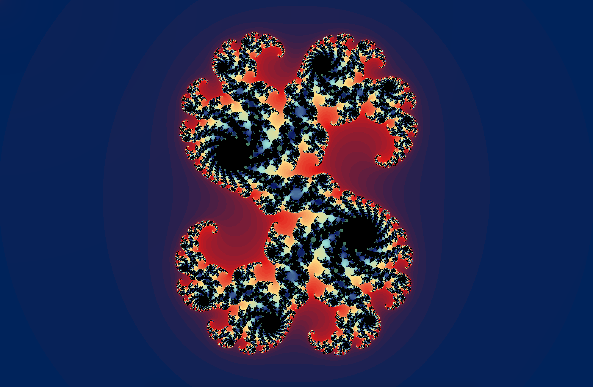
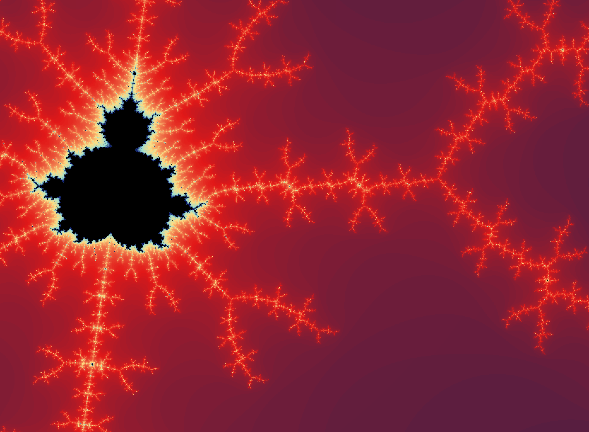
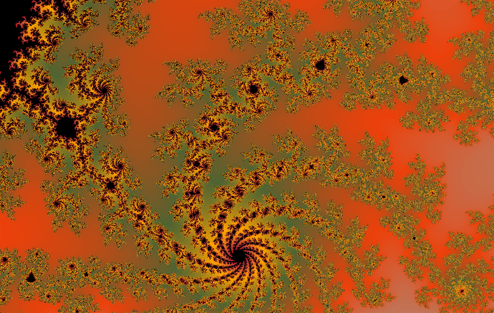

<div align="center">

  <h1>FRACTOL</h1>
  
  <p>
    This project is about creating graphically beautiful fractals.
  </p>
</div>
  

# About the Project

A project made in accordance with the fractol project which is part of the Codam Core Curriculum. This was my introduction into programming graphics. For this project it was mandatory to use the schools graphic's library (https://github.com/codam-coding-college/MLX42).
 
 
 
 

# Getting Started

Start by cloning the repository:
```c
git clone https://github.com/fkoolhoven/fractol.git
```

Compile by using make:
```c
make
```

# Usage

To display the Mandelbrot fractal:
```c
./fractol mandelbrot
```
To display the Julia fractal:
```c
./fractol julia [real component of c] [imaginary component of c]
```
For example:
```c
./fractol julia -0.538 0.50695
```
- Zoom in and out with the mousewheel
- Adjust view using the arrow keys
- Quit the program with ESC or the window's close button

# Important Learnings


# Contact

See my profile page for ways to contact me!
